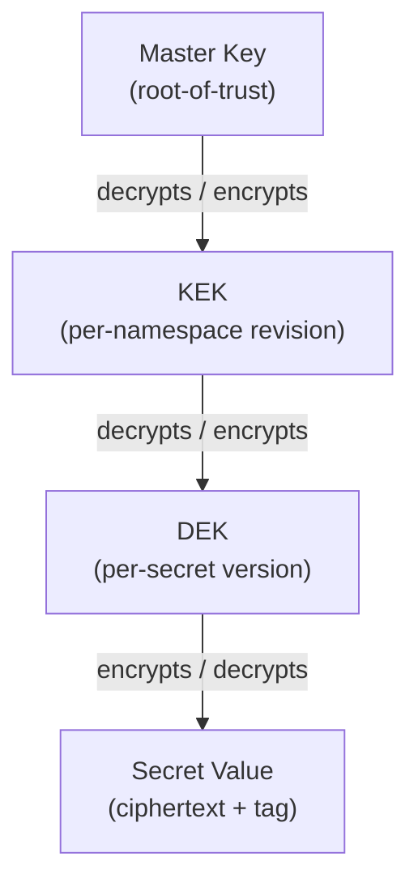
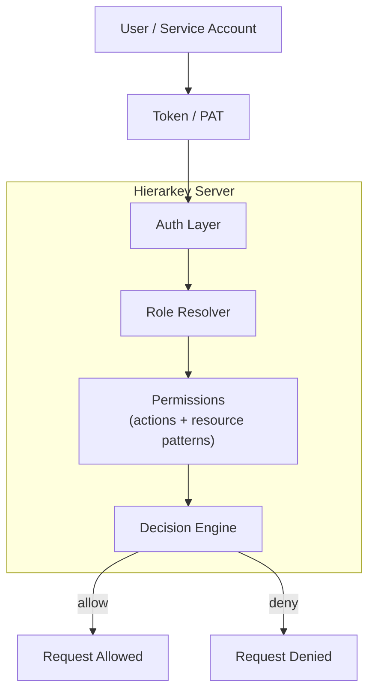
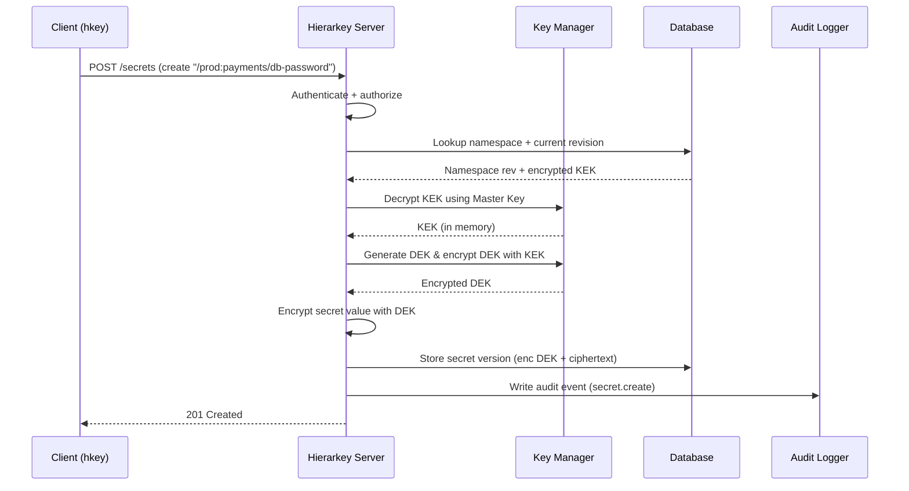
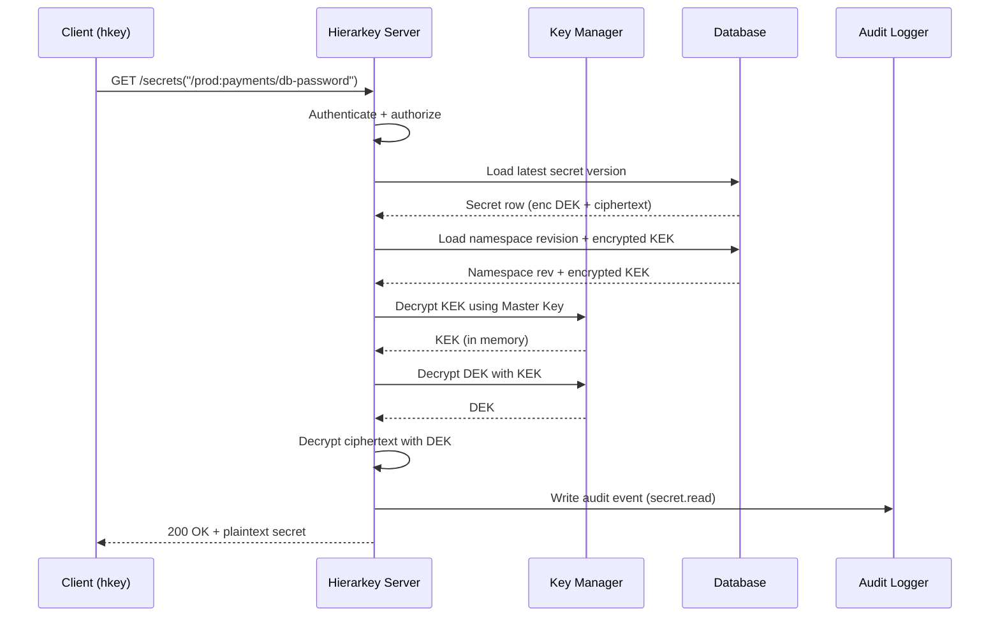

# Hierarkey Architecture

Hierarkey is a **hierarchical secret management platform**.

Internally it’s built around four core ideas:

1. A **key hierarchy**: `Master Key -> KEK -> DEK -> Encrypted Secret`
2. **Namespaces** and **RBAC** to control who can access what
3. **Revisions** for immutable history of namespaces and secrets
4. **Auditing** for traceability and compliance

This document explains how the server works at a high level and includes diagrams you can embed in your docs.

---

## 1. High-level overview

At a very high level:

- The **Hierarkey server** exposes an HTTP API.
- Clients (`hkey` CLI, apps, CI/CD) talk to the server using **authenticated requests**.
- The server stores:
  - **Namespaces** (with KEKs and metadata)
  - **Secrets** (with multiple versions, each encrypted with its own DEK)
  - **Users / tokens** (for auth & RBAC)
  - **Audit events**

Conceptually:

```text
        +-------------------+
        |   Clients (hkey)  |
        |   Apps / CI/CD    |
        +---------+---------+
                  |
                  v
        +-------------------+
        |  Hierarkey Server |
        |   (HTTP + RBAC)   |
        +---------+---------+
                  |
          +-------+--------+
          |   PostgreSQL   |
          |  (encrypted    |
          |   data store)  |
          +----------------+
```

---

## 2. Key hierarchy: Master Key -> KEK -> DEK -> Secret

Hierarkey uses a **three-tier key hierarchy**:

1. **Master Key**
2. **KEK (Key Encryption Key)**
3. **DEK (Data Encryption Key)**

The hierarchy:

```text
[Master Key]  -->  decrypts KEKs
[KEK]        -->  decrypts DEKs
[DEK]        -->  encrypts/decrypts secret values
```

### Key hierarchy diagram (Mermaid)



### 2.1 Master Key

The **Master Key** is the root of trust.

- It is **never stored plaintext in the database**.
- It is only available via a **master key provider**, configured in `config.toml`, for example:
  - `insecure` – a key file on disk (useful for testing and development)
  - `passphrase` - on disk but encrypted with a passphrase provided during startup
  - `pkcs11` – a key stored in an HSM via PKCS#11
- The master key is used to **encrypt and decrypt KEKs**. It is not used to encrypt secrets directly.

If you lose the Master Key, you cannot decrypt any KEKs and therefor no secrets.

### 2.2 KEK (Key Encryption Key)

A **KEK** protects secrets within a **namespace**.

- Each namespace has **its own KEK**.
- The KEK itself is stored **encrypted with the Master Key** in the database.
- Rotating a namespace KEK does **not** require re-encrypting the master key – just generate a new KEK and encrypt it with the master key.

Conceptually, a namespace row might contain:

- Namespace path: `/prod`
- Encrypted KEK blob
- Metadata / labels / created_at

When the server needs to handle secrets in that namespace revision:

1. Load the encrypted KEK from the DB.
2. Decrypt the KEK using the **Master Key** from the configured provider.
3. The KEK is stored in memory for a short time.
4. Use the KEK to decrypt/encrypt **DEKs** for secrets in that namespace revision.

### 2.3 DEK (Data Encryption Key)

A **DEK** is used to encrypt a **single secret version**.

- **One DEK per secret version**
- DEK is a random symmetric key (e.g. 256-bit).
- DEK is stored in the database **encrypted with the namespace’s KEK**.
- The encrypted secret value is stored in the database **encrypted with the DEK** using a modern AEAD cipher (e.g. AES-256-GCM).

So for each secret version, the DB stores roughly:

- Reference: `/prod:payments/db-password`
- Revision
- Encrypted DEK
- Encrypted secret blob
- Nonce/IV, auth tag, algorithm identifiers
- Metadata (labels, created_by, created_at, etc.)

---

## 3. Namespaces, KEKs, and longest-prefix matching

Namespaces define **boundaries** for keys and policies.

- A namespace is a **path** starting with `/`, e.g.:
  - `/prod`
  - `/prod/payments`
  - `/dev`
- Each namespace has a **KEK**.

When you store a secret, you need to specify its **reference path**, for example:

```text
/prod:payments/service/api-key
```

the server:

1. Splits it into:
   - Namespace part: `/prod`
   - Key path: `payments/service/api-key`
2. Checks RBAC permissions for that namespace and secret key path.
3. Uses the KEK from the current **namespace** to protect the DEK.

---

## 4. RBAC: Users, tokens, and permissions

Hierarkey uses **role-based access control** (RBAC) to decide who can do what.

At a high level:

- **Users**: identified by username, etc.
- **Tokens / PATs**: used by clients to authenticate.
- **Roles / permissions**: define allowed actions.
- **Scopes / resource patterns**: specify *where* those actions are allowed (e.g. which namespaces).

### 4.1 Authentication

Clients authenticate via something like:

- **Bearer token** in the `Authorization` header (PAT).
- Possibly other methods (mTLS, OIDC) in the future.

Each token is linked to a **principal** (user or service account), which has roles.

### 4.2 Permissions model

A simplified view of permissions:

- **Resources**:
  - Namespaces (`namespace:/prod`, `namespace:/team/payments`)
  - Secrets (`secret:/prod:payments/*`, etc.)
  - Admin / system functions
- **Actions**:
  - `namespace:create`, `namespace:describe`, `namespace:update:meta`, `namespace:list`, `namespace:delete`
  - `secret:create`, `secret:reveal`, `secret:revise`, `secret:delete`, `secret:list`, `secret:describe`
  - `audit:read`, `rbac:admin`, `platform:admin`

Roles combine **rules** (each of the form `allow <permission> to <target> <pattern>`), for example:

- `prod-admin`:
  - `allow platform:admin to all`
- `team-payments-reader`:
  - `allow secret:reveal to namespace /prod/payments`
- `team-payments-writer`:
  - `allow secret:* to namespace /prod/payments`

When a request comes in:

1. The server authenticates the token -> resolves the principal.
2. Looks up the principal’s roles.
3. Determines whether the requested action on the specific secret/namespace is allowed.

### RBAC diagram (Mermaid)



---

## 5. Revisions: Namespaces and secrets

Hierarkey treats data as **append-only** wherever possible:

- Updates create **new revisions** rather than modifying in place.
- This provides a **history** that can be used for auditing and rollbacks.

### 5.1 Namespace updates

Namespaces do not have revisions. Updates (metadata, labels, description) are applied in-place.

KEK rotation is tracked separately: when you rotate a namespace's KEK, a new KEK is created and assigned to the namespace. New DEKs are encrypted with the new KEK; existing DEKs remain encrypted with the old KEK until you explicitly rekey them. Old KEKs cannot be removed as long as any DEK still references them.

### 5.2 Secret revisions (versions)

Each secret path has multiple **versions**:

- `/prod:payments/api-key@1`
- `/prod:payments/api-key@2`
- `/prod:payments/api-key@3`
- `/prod:payments/api-key@latest` (alias for latest version)
- `/prod:payments/api-key@active` (alias for latest version)
- `/prod:payments/api-key` -> alias for *active* version (`@3`)

When you:

- **Create** a secret: version `1`.
- **Revise** a secret: version `2`, `3`, etc.

Old versions are not overwritten; they remain available unless explicitly pruned by retention policy.

---

## 6. Request flow examples

### 6.1 Writing a new secret

Example: `hkey secret create --ref /prod:payments/db-password --value "S3cret!"`

Server-side steps:

1. **Authenticate** the request (validate token).
2. **Authorize**: check `secret:create` for `/prod:payments/db-password`.
3. **Resolve namespace**:
   - Fetch **current namespace**
4. **Load KEK**:
   - Get active encrypted KEK for namespace from DB.
   - Use **Master Key** to decrypt KEK in memory.
5. **Generate DEK**:
   - Random 256-bit symmetric key.
6. **Encrypt DEK** with KEK -> store encrypted DEK.
7. **Encrypt secret value** with DEK (e.g. AES-GCM):
   - Produce ciphertext, nonce, auth tag.
8. **Store secret version** row:
   - Secret path, version number (e.g. 1 or N+1)
   - Namespace revision ID
   - Encrypted DEK
   - Ciphertext + nonce + tag
   - Metadata (labels, created_at, created_by)
9. **Write audit log** entry:
   - Principal, action, path, version, timestamp, client IP (hashed if enabled).

#### Sequence diagram – write flow



---

### 6.2 Reading a secret

Example: `hkey secret reveal --ref /prod:payments/db-password`

Server-side steps:

1. **Authenticate** token.
2. **Authorize**: check `secret:reveal` on the secret path.
3. **Resolve secret path**:
   - Determine latest version (e.g. `3`).
   - Load secret version row.
4. **Resolve namespace revision**:
   - From secret row, identify namespace KEK id.
5. **Load KEK**:
   - Fetch encrypted KEK for namespace.
   - Decrypt KEK with **Master Key**.
6. **Load DEK**:
   - Decrypt encrypted DEK with KEK.
7. **Decrypt secret**:
   - Decrypt ciphertext with DEK.
   - Verify auth tag (tamper detection).
8. Return plaintext secret to the client over the already-secured channel (TLS).
9. Write **audit log** entry for the read access.

#### Sequence diagram – read flow



---

## 7. Auditing and privacy

Every important action generates an **audit event**, for example:

- Namespace create/update/delete
- Secret create/update/read/delete
- Login / token creation
- RBAC changes

Each event typically includes:

- Timestamp
- Principal (user/service)
- Action (e.g. `secret:reveal`)
- Resource (e.g. `/prod/payments:db-password`)
- Result (success/failure)
- Client IP address (optionally hashed)

### 7.1 IP hashing / anonymisation

To help with privacy regulations, Hierarkey can:

- Hash IP addresses with a configurable `ip_hash_salt`.
- Store only the hash, not the raw IP.
- Anonymise IPs (based on subnet mask) while still allowing correlation of events from the same source.

This allows:

- Correlating activity from the same IP (same hash),
- Without being able to reverse it (salt is stored separately from audit logs or even on a different system).

Audit logs can be:

- Written to `stdout` and collected by tools like Filebeat / Fluentd, or
- Written to a file or external log store.

---

## 8. Summary

Hierarkey’s architecture is built around:

- A **key hierarchy** ensuring encryption at rest:
  - Master Key -> KEKs -> DEKs -> encrypted secrets
- **Namespaces** with **KEKs** to structure secrets.
- **RBAC** with roles and resource patterns for fine-grained access control.
- **Immutable secret revisions** enabling history and rollbacks (namespaces are updated in-place).
- **Auditing** with optional IP anonymisation for compliance.

Together, this gives you a **secure, auditable, and flexible** secret management platform that fits modern infrastructure and regulatory requirements.


## 8.1 Security considerations

Hierarkey protects secrets using multiple layers of security controls:

- **Memory Safety by Design (Rust)**  
  The server is implemented in Rust, which eliminates broad classes of memory-unsafe bugs common in C/C++ (use-after-free, double-free, buffer overflows, etc.), reducing the risk of remote code execution vulnerabilities.

- **Zeroization of Sensitive Key Material**  
  Master keys, KEKs, and DEKs are handled in dedicated structures that are explicitly zeroed from memory when dropped (e.g. via Rust’s zeroization patterns), reducing the window in which key material is present in process memory.

- **Secure Defaults for Transport**  
  The API is designed to be exposed over TLS (HTTP+TLS or behind a TLS-terminating proxy), so secrets are protected in transit as well as at rest.

- **Tamper proof Encryption (AEAD)**  
  Secrets are encrypted using modern Authenticated Encryption with Associated Data (AEAD) algorithms (e.g. AES-256-GCM), ensuring both confidentiality and integrity of secret values.

- **Key Rotation Support**  
  Both KEKs and the Master Key can be rotated without downtime. KEK rotation can be done per-namespace, and Master Key rotation can be performed via re-wrapping existing KEKs.

- **Minimal Attack Surface**  
  The server exposes a minimal API surface, with strict authentication and authorization checks on every request, reducing the risk of unauthorized access.

- **Defense in Depth via Layered Encryption**  
  The multi-tier key hierarchy ensures that even if one layer is compromised (e.g. a DEK), higher-level keys (KEKs, Master Key) remain secure, limiting the scope of potential breaches.

- **Integrity checks on SQL rows**
  Specific rows (RBAC, user credentials and permissions) includes integrity tags to detect tampering, ensuring that any unauthorized modifications are detected during read operations.

- **Encryption at Rest (Master Key -> KEK -> DEK)**  
  All secrets are encrypted with a per-version Data Encryption Key (DEK), which is wrapped by a per-namespace Key Encryption Key (KEK), which in turn is protected by a master key from a configurable provider (file, env, HSM/PKCS#11).

- **Namespace Isolation & Key Scoping**  
  Secrets live inside namespaces with their own KEKs, so different environments/teams can be cryptographically isolated (e.g. `/prod`, `/dev`, `/team/payments`).

- **Fine-Grained Access Control (RBAC)**  
  Role-based permissions determine who can create, read, update, or list secrets and namespaces, down to specific secret paths and operations.

- **Immutable Versioning & Integrity**  
  Secret updates create new versions instead of overwriting data. This gives a tamper-evident history, safe rollback, and easier incident forensics.

- **Auditing & Privacy-Aware Logging**  
  Every important action (secret reads/writes, namespace changes, RBAC changes, logins) is logged with who/what/when, with optional IP hashing for privacy-friendly traceability.
